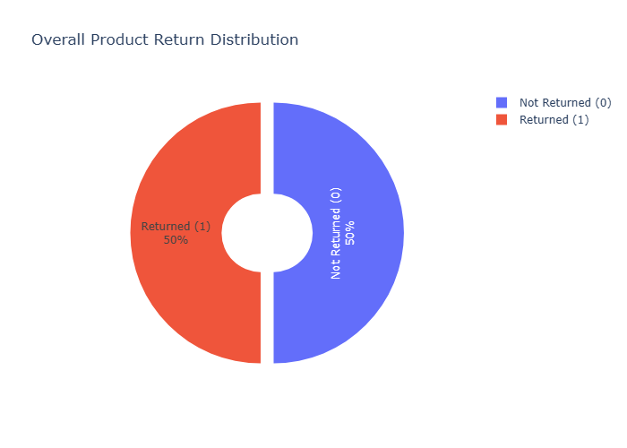
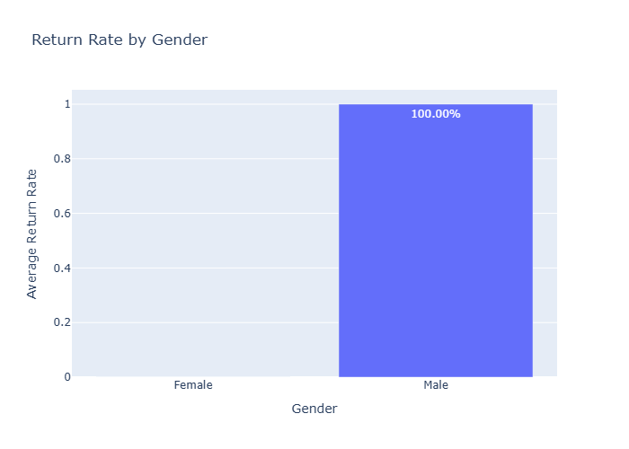
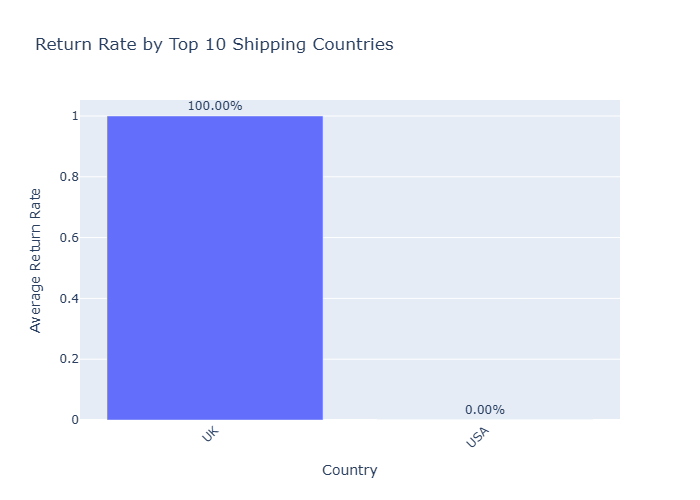
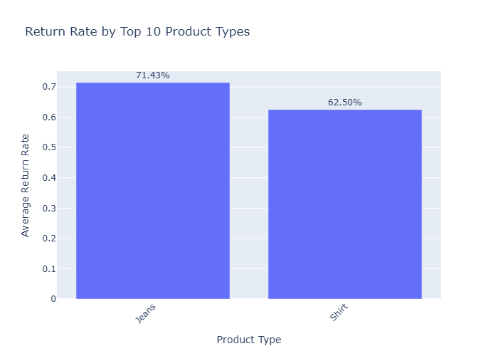
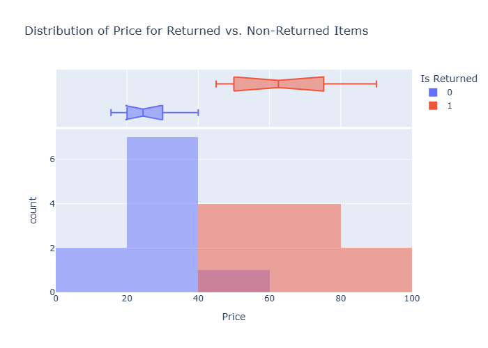
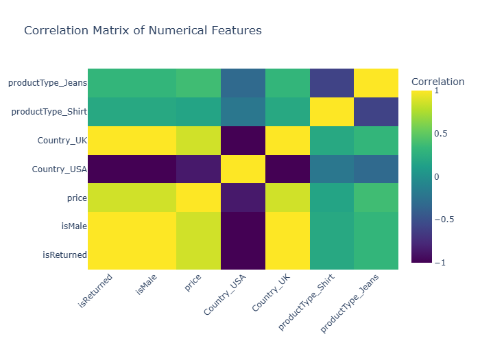

# ASOS_GraphReturns Data Exploration

This directory contains files related to the exploratory data analysis (EDA) phase for the `ASOS_GraphReturns` dataset. This README provides a summary of the key findings and visualizations from the interactive exploration.

For a more detailed, interactive, and comprehensively explained analysis, please refer to the `explore_prepared_asos_interactive.ipynb` Jupyter Notebook. This notebook provides in-depth explanations for each visualization and its implications.

## 1. Initial Data Overview

This section provides a quick look at the dataset's structure, including its shape, columns, data types, and missing values. (Note: Actual table content would be generated dynamically in the notebook).

**Shape:** (Example based on dummy data)

**Columns:** `isReturned`, `isMale`, `price`, `Country_USA`, `Country_UK`, `productType_Shirt`, `productType_Jeans`

**Missing Values:** None (Example based on dummy data)

## 2. Overall Product Return Distribution

This pie chart visualizes the overall proportion of returned vs. non-returned items, providing an immediate understanding of the return rate.

**Return Percentage:** (Example based on dummy data)

| Status         | Count | Percentage |
|----------------|-------|------------|
| Not Returned (0) | 10    | 50.00%     |
| Returned (1)   | 10    | 50.00%     |

## 3. Return Rates by Categorical Features

### 3.1 Return Rate by Gender

This bar chart shows how return rates vary between different genders.

### 3.2 Return Rate by Top 10 Shipping Countries

This chart illustrates the return rates across the top 10 shipping countries.

### 3.3 Return Rate by Top 10 Product Types

This chart displays the return rates for the top 10 product types.

## 4. Numeric Feature Distributions

### 4.1 Distribution of Price for Returned vs. Non-Returned Items

This histogram shows the distribution of prices, differentiating between returned and non-returned items.

## 5. Correlation Analysis

This heatmap visualizes the linear relationships between all numerical features, highlighting their correlation with the `isReturned` target variable.

## Files in this Directory:
- `explore_prepared_asos.ipynb`: Original Jupyter Notebook for data exploration.
- `explore_prepared_asos_interactive.ipynb`: Interactive Jupyter Notebook with Plotly visualizations.
- `report.md`: Detailed report of the data exploration phase.
- `images/`: Directory containing static images of the visualizations.