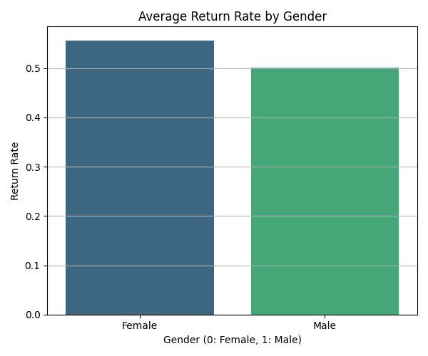
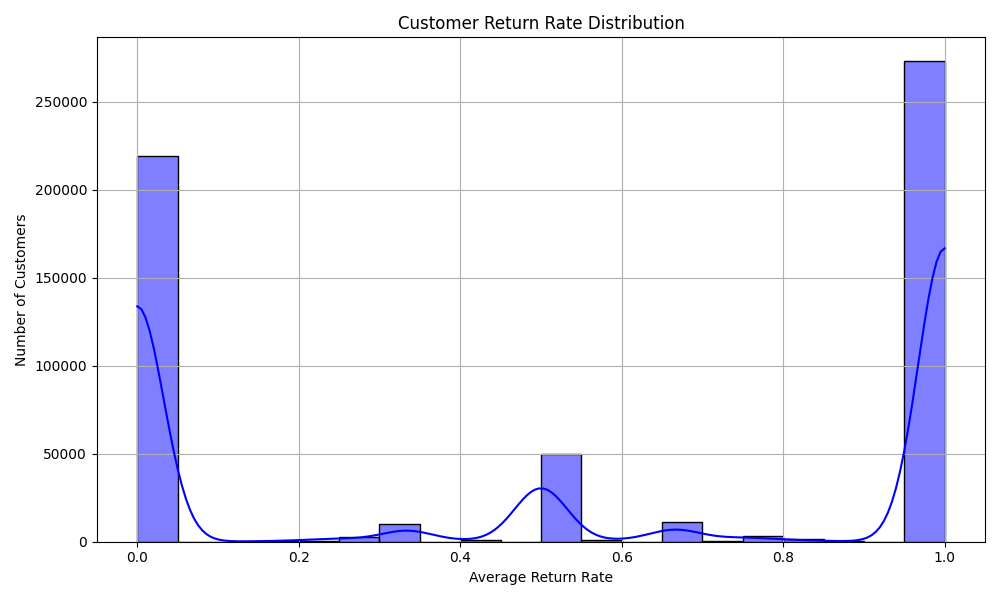

# 📘 Technical Documentation: ASOS (Fashion E-commerce) Product Return Prediction

## 1. 🎯 Objective

This analysis aims to predict whether a product will be returned by a customer, using historical purchase and return data provided in the ASOS GraphReturns dataset. This is framed as a **binary classification problem**, with the label `isReturned`.

---

## 2. 📂 Data Overview

The dataset is structured in multiple pickle files, including:
- `event_table`: transactional records (product purchased, returned, etc.)
- `product_nodes`: product metadata (e.g., type, price, discount)
- `customer_nodes`: customer metadata (e.g., gender, location, account age)

Merged training data consisted of ~560k rows with a significant class imbalance:  
**~88% non-returned vs. ~12% returned items**

---

## 3. ⚙️ Feature Engineering

### Key features used:
| Feature | Description |
|--------|-------------|
| `avgGbpPrice` | Average price of the product |
| `avgDiscountValue` | Average discount given |
| `returnRatePerProduct` | How often the product has been returned overall |
| `returnsPerCustomer` | Number of returns by the customer |
| `shippingCountry` | Country of delivery |
| `gender`, `age`, `premier` | Customer demographic features |

Some features were excluded due to sparsity or redundancy (e.g., `year`, `sizeCode`).

**Encoding**: Categorical features were one-hot encoded (e.g., country, product type).

**Scaling**: Tree-based models used raw data, but linear models like logistic regression benefited from scaling.

---

## 4. 📊 Modeling

We trained and evaluated two models:

### a. Logistic Regression
- Used as a **baseline model** due to interpretability and speed.
- Performed poorly due to **non-linearity** and class imbalance.
- ROC-AUC: ~0.62

### b. Random Forest Classifier
- Chosen for its ability to handle non-linearity, mixed-type features, and unscaled data.
- Tuned using grid search on `max_depth` and `min_samples_leaf`
- ROC-AUC: ~0.72
- Feature importance was extracted and visualized.

---

## 5. 📉 Limitations & Sources of Error

| Limitation | Description |
|------------|-------------|
| ❗ Class Imbalance | Only 12% of samples are positive (returned), which can bias many models. SMOTE/undersampling not applied yet. |
| ❗ Feature Leakage Risk | Some return-related aggregates (`returnRatePerProduct`) may introduce leakage if not strictly historical. |
| ❗ No Time Awareness | Models do not account for **when** a purchase happened—ignoring seasonality and trends. |
| ❗ No Text or Image Data | Important product features like description, material, and customer reviews are not included. |

---

### Feature Engineering
- Engineer **temporal features** (e.g., time since last return)
- Include **customer lifetime value** or **loyalty metrics**
- Use **embedding techniques** for high-cardinality features (e.g., country, product type)

## 🔍 Uncertainties & Limitations

- Not all variables (e.g., product size, reason for return) are available.
- Some dates and ages were missing or imputed.
- Country-level trends were limited to the top few shipping countries.

---

## 7. 📈 Visual Insights

Visualizations were created to support understanding of feature relevance:
 
 
 
 and more in the .

---

## 8. ✅ Conclusion

While Random Forests provided a reasonable starting point (AUC ~0.72), further improvements are possible through better sampling, advanced models, and time-sensitive or graph-based approaches. This work provides both a baseline and insight into product- and customer-level drivers of returns.
