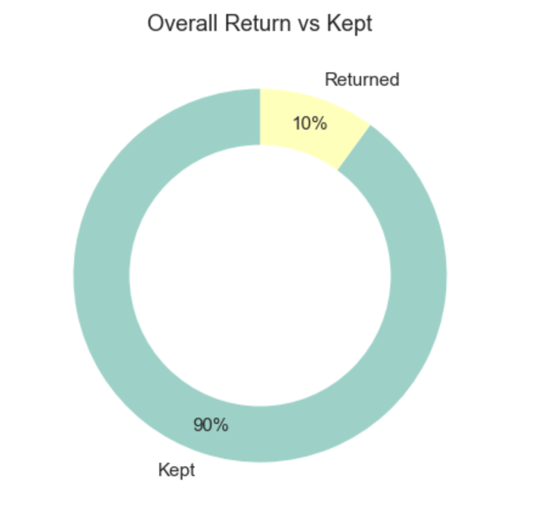
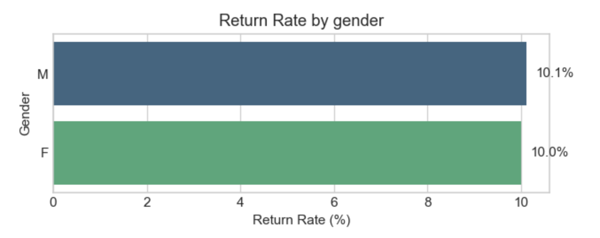
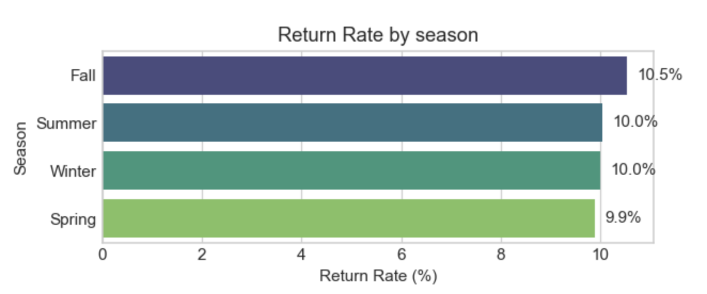
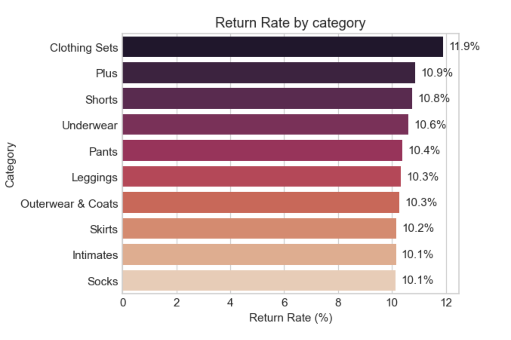
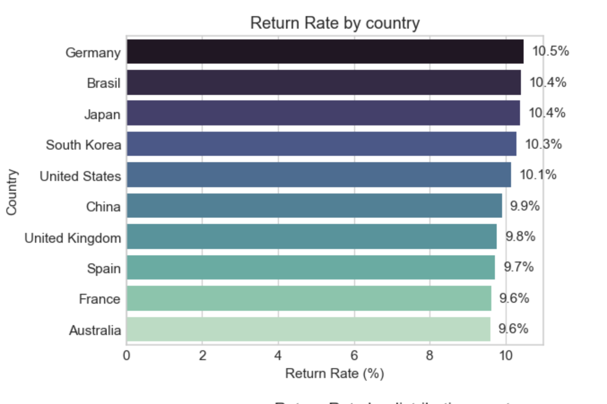
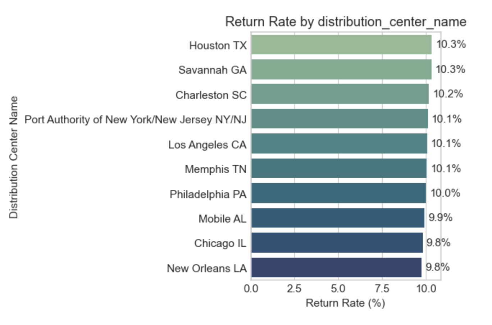
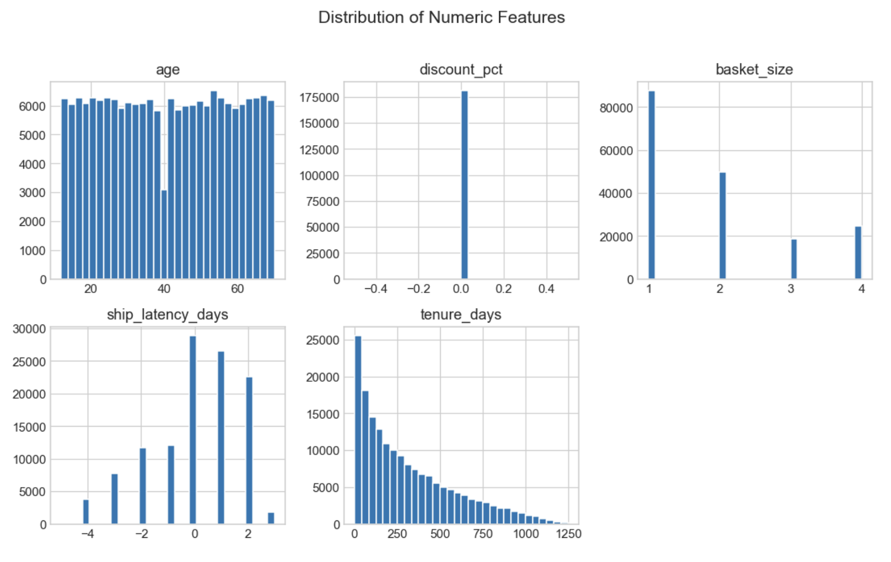
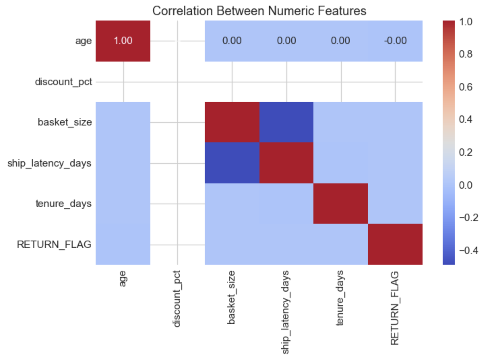

# 📦 TheLook E-commerce — Data Exploration

This notebook documents our first look at the cleaned feature set and highlights the main patterns we’ll investigate further in the analysis phase.

---

## 1. Data Loaded
- **File:** `thelook_returns_features.csv`  
- Shape: *rows × columns* printed in the notebook header.

---

## 2. Quick Inspection
- Checked column data types and missing-value counts.
- No major null issues; dataset is ready for analysis.

---

## 3. Overall Return Share  

---

## 4. Return Rates by Key Categories

### Gender Returns  

### Season Returns  

### Product Category Returns  

### Country Returns  

### Distribution Center Returns  

---

## 5. Numeric Distributions

- `age`
- `discount_pct`
- `basket_size`
- `ship_latency_days`
- `tenure_days`

> The distributions are reasonable; no major outliers or skewed values observed.

---

## 6. Correlation Heat-map

- Most numeric features show **weak linear correlation** with `RETURN_FLAG`.
- Confirms we’ll need **non-linear models** or **categorical features** to explain returns effectively.

---

## 7. First Observations

- **Gender** has no meaningful impact on returns.
- **Season** and **product category** affect return rates—clothing and fall show higher returns.
- **Regional trends** suggest operational or cultural return behaviour.
- **Numeric features alone aren’t predictive**, but will support a model alongside categorical data.

These insights will inform our upcoming **Data Analysis** phase, where we build models and quantify the impact of each feature.