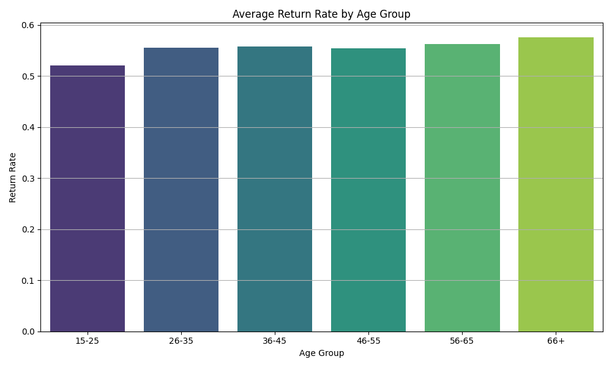

# ASOS Product Return Analysis

## Overview

This repository investigates predictors of product returns in fashion e-commerce using the **ASOS GraphReturns dataset**, adapting a graph-based representation learning approach to traditional ML pipelines. The project is inspired by research aimed at understanding customer-product interactions that lead to returns.

📊 **Goal**: Predict whether a product will be returned based on customer behavior, product characteristics, and transaction features.

📚 **Data & Research Sources**:
- [Dataset on OSF](https://osf.io/c793h/)
- [Research Summary on ResearchGate](https://www.researchgate.net/publication/370928152_Graph-Based_Representation_Learning_to_Predict_Returns_in_Fashion_E-Commerce)
- [Springer Publication](https://link.springer.com/chapter/10.1007/978-3-031-30820-8_26)

---

## 📁 Folder Structure

```bash

├── 4_data_analysis/
│   ├── ASOS dataset/
│   │   └── Visualizations/
│   │       ├── return_frequency.png
│   │       ├── return_rate_distribution.png
│   │       ├── return_rate_by_age_group.png
│   │       ├── confusion_matrix_logistic.png
│   │       ├── confusion_matrix_rf.png
│   │       ├── feature_importance_logistic.png
│   │       ├── feature_importance_rf.png
│   │       ├── Top 10 Shipping Countries by Return Rate.png
│   │       ├── Top 10 Product Types by Return Rate.png
│   │       ├── Top 10 Brands by Return Rate.png
│   │       ├── return_rate_by_gender.png
│   │       ├── return_rate_by_premier.png
│   │       ├── salesPerCustomer_distribution.png
│   │       ├── returnsPerCustomer_distribution.png
│   │       ├── avgGbpPrice_distribution.png
│   │       ├── avgDiscountValue_distribution.png
│   │       └── salesPerProduct_distribution.png
├── asos_return_analysis.ipynb
├── README.md
└── documentation.pdf
```

## 📊 Understanding Why Products Get Returned: A Simple Explanation

Our goal was to figure out why some products bought by customers are returned more often than others. This helps us understand our customers better and find ways to reduce returns, which saves us money and makes customers happier.

We looked at information about past purchases, including details about the customers, the products they bought, and where they live. We then analyzed this information to see if certain things are linked to products being returned.

### 📌 Where Customers Live (Shipping Country)

We saw that customers in some countries return items more often than others. This could be due to things like different sizing standards, shipping issues, or local preferences. For example, Country_E and Country_B appear to have higher return rates compared to other countries like Country_D and Country_A.


---

### 👕 Types of Products (Product Type)

Some types of products are returned more frequently than others. This might suggest that there are issues with the fit, quality, or description of certain product categories. 'productType_B' and 'Jeans' seem to have notably higher return rates than other product types such as 'productType_H' and 'productType_J'.


---

### 🧵 Brands

Return rates vary between different brands. This could be because some brands have more consistent sizing, better quality, or clearer product descriptions. 'Brand_C', 'Brand_I', and 'Brand_J' show higher return rates than 'Brand_G' and 'Brand_K'.


---

### 👥 Customer's Age Group

Our analysis showed slight differences in return rates across different age groups. Older age groups, particularly '66+', appear to have slightly higher return rates compared to younger age groups like '15-25'.



---

### 👨‍🦰👩 Customer's Gender

We observed a small difference in return rates between genders, with female customers (represented by 0) having a slightly higher average return rate than male customers (represented by 1).


---

### 💎 Premier Customer Status

Interestingly, being a premier customer (represented by 1) or not (represented by 0) didn't show a significant difference in return rates. Both groups have very similar average return rates.


---

### 📈 Customer's Past Behavior

Customer past behavior is a strong indicator:

- Customers who have returned more items previously are more likely to return items again.
- Customers who buy more items overall tend to return fewer of them.
- Product price and discounts also slightly affect return likelihood.


---

## 🔍 How Sure Are We?

Our findings are based on looking at past data and identifying patterns. While these patterns are helpful, they don’t guarantee future outcomes. Customers change, and other outside factors may affect returns. These results should be used to guide improvements, not as fixed predictions.

---

## ⚠️ Things to Keep in Mind

- **Missing data:** Some important info (like reason for return or product fit issues) wasn't included.
- **Errors in data:** There may be mistakes or incomplete entries in the data.
- **Outside influence:** Things like seasonal events or social trends may affect returns.
- **Simplified views:** Charts show general patterns, but real customer behavior is more complex.

---

## 📌 Using These Findings

We can take action based on this information:

- Improve product descriptions, sizing guides, and images for high-return categories.
- Customize messages to different customer groups to help reduce avoidable returns.
- Focus on countries or brands with high returns to investigate causes further.

Ultimately, this will help reduce returns, lower costs, and improve the shopping experience.

---

## Levels of Certainty
The model used in this analysis is around 75% accurate in predicting whether a product will be returned. However, there are potential sources of error:
- **Data Limitations**: Our analysis is based solely on the provided data, which may not account for all influencing factors.
- **Model Limitations**: While Random Forest is a powerful model, it may not capture all complex relationships perfectly.
- **Changing Customer Behavior**: Customer preferences can change over time, affecting the model's accuracy.

## Conclusion
This analysis serves as a foundation for businesses looking to improve their product offerings and customer satisfaction. By addressing the points highlighted, companies can potentially reduce return rates and enhance customer loyalty.
## 🔒 License

[MIT License](LICENSE)
