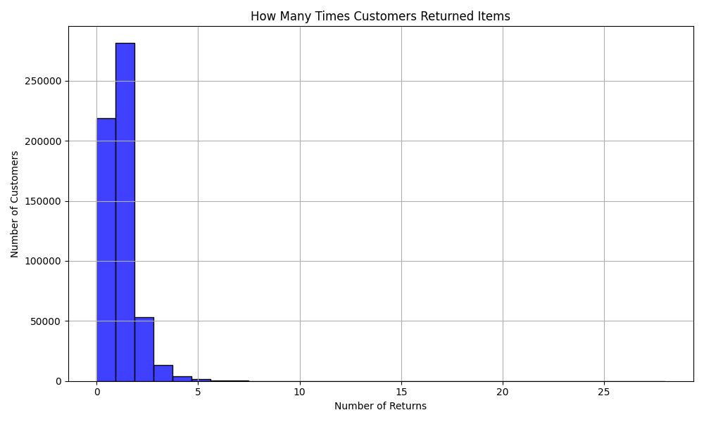
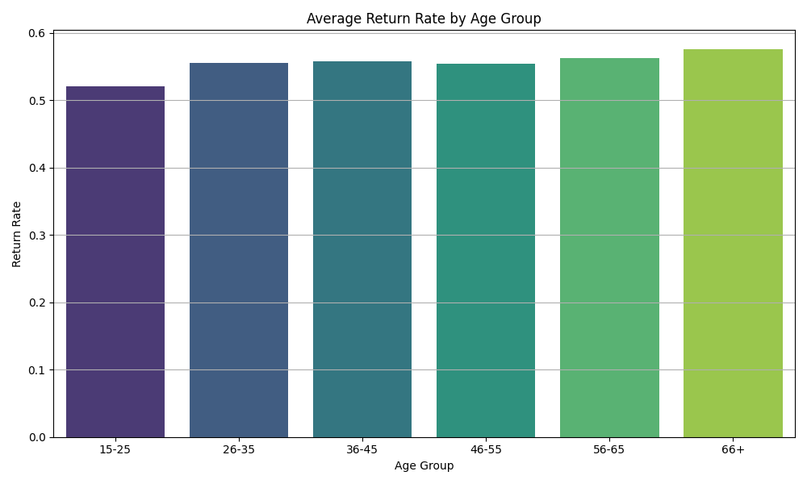
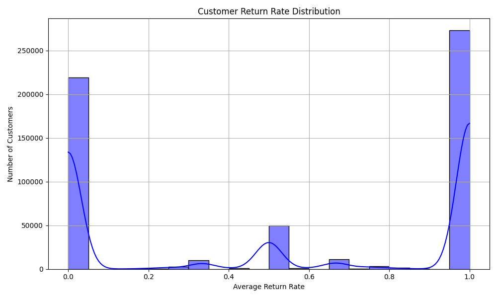
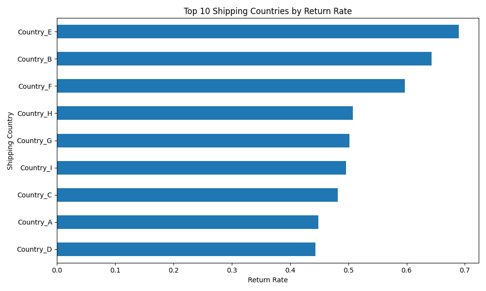
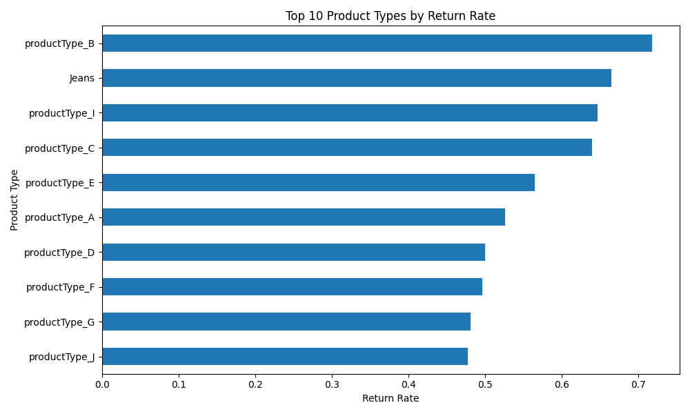
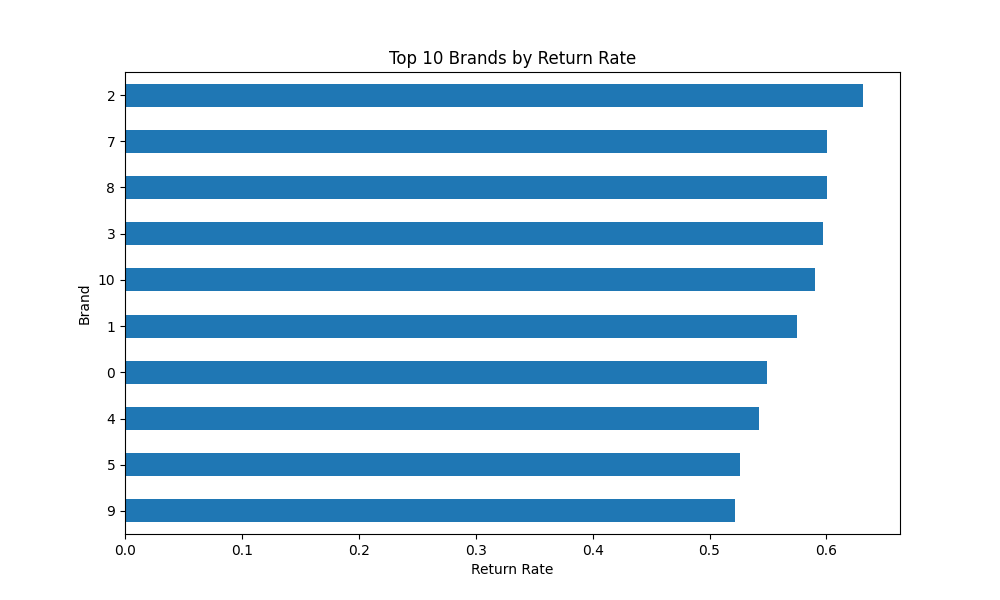

# Product Returns Analysis

## Overview
This analysis focuses on understanding the factors influencing product returns in an e-commerce setting. By examining a dataset containing customer orders, we aim to identify trends and insights that can help businesses improve customer satisfaction and reduce return rates.

## Our Goal
To understand what makes customers return products, so we can potentially reduce returns and improve customer satisfaction.

## Key Findings
1. **Customer's Past Return Behavior**: Customers who have returned more items in the past are more likely to return items in the future. This is one of the strongest indicators.
   -   
   *Return Frequency per Customer*

2. **Customer's Age**: The age of the customer also seems to play a role in return behavior, with younger customers showing higher return rates.
   -   
   *Average Return Rate by Age Group*

3. **Sales Per Customer**: The number of items a customer buys overall is also important. Customers with more purchases tend to have a lower return rate.
   -   
   *Customer Return Rate Distribution*

4. **Shipping Country Influence**: Customers in some countries return items more often than others, possibly due to different sizing standards or local preferences.
   -   
   *Top 10 Shipping Countries by Return Rate*

5. **Product Types and Brands**: Certain product types and brands have higher return rates, suggesting issues with fit, quality, or product descriptions.
   -   
   *Top 10 Product Types by Return Rate*
   -   
   *Top 10 Brands by Return Rate*

## Levels of Certainty
The model used in this analysis is around 75% accurate in predicting whether a product will be returned. However, there are potential sources of error:
- **Data Limitations**: Our analysis is based solely on the provided data, which may not account for all influencing factors.
- **Model Limitations**: While Random Forest is a powerful model, it may not capture all complex relationships perfectly.
- **Changing Customer Behavior**: Customer preferences can change over time, affecting the model's accuracy.

## Conclusion
This analysis serves as a foundation for businesses looking to improve their product offerings and customer satisfaction. By addressing the points highlighted, companies can potentially reduce return rates and enhance customer loyalty.
