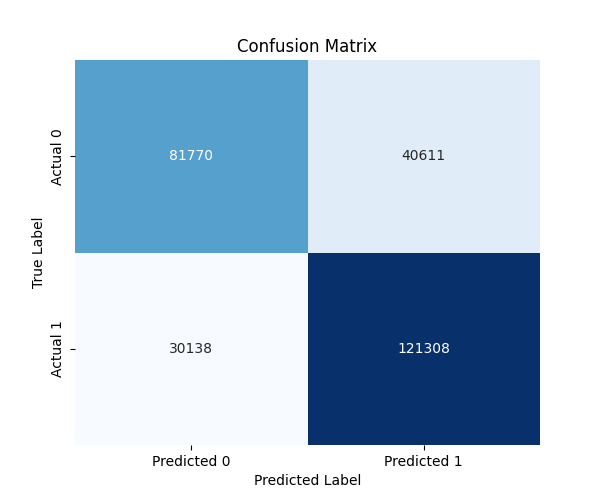
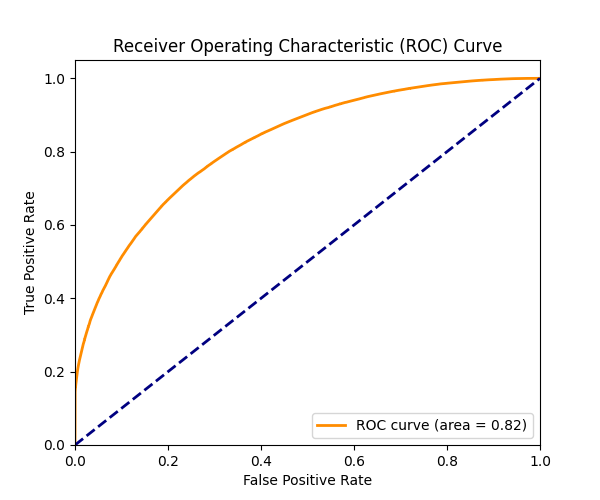
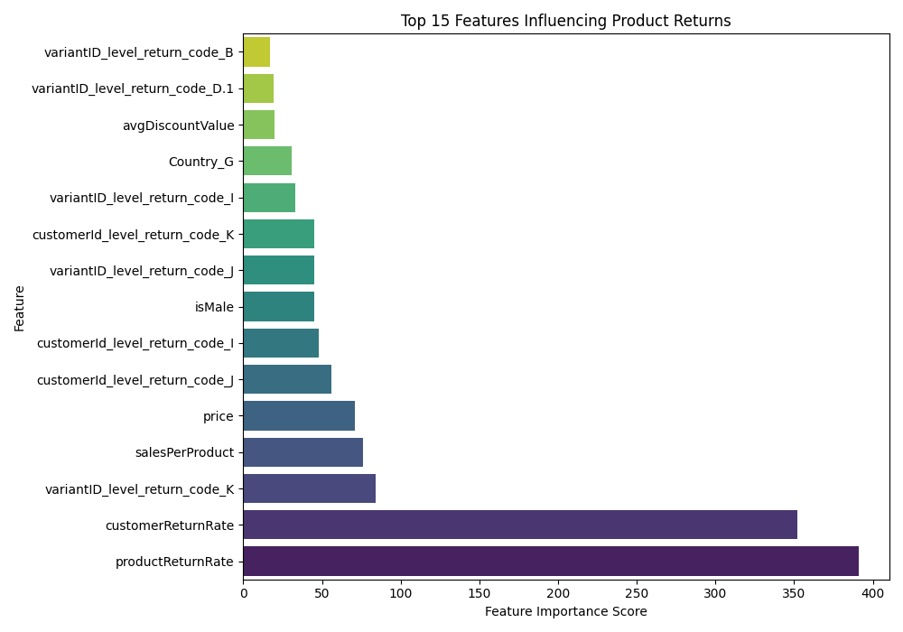

# ASOS_GraphReturns Data Analysis

This directory is dedicated to the data analysis and predictive modeling phase for the `ASOS_GraphReturns` dataset. The primary goal is to build and evaluate a machine learning model to predict product returns.

## 📊 Process Overview: `analyze_asos_data.py`

| Section | Description |
|---|---|
| **Data Loading** | Loads the `prepared_asos_data.csv` file, which is the output from the data preparation phase. |
| **Missing Value Handling** | Fills any remaining missing numerical values with the mean of their respective columns. |
| **One-Hot Encoding** | Applies one-hot encoding to categorical features (`shippingCountry`, `productType`, `brandDesc`) to convert them into a numerical format suitable for machine learning models. |
| **Feature & Target Definition** | Defines the features (`X`) and the target variable (`isReturned`, `y`) for the predictive model. Excludes ID columns and the original categorical columns after encoding. |
| **Train-Test Split** | Splits the dataset into training and testing sets (80/20 split) using stratification to maintain the class balance of the target variable. |
| **Model Training (LightGBM)** | Initializes and trains a `LightGBMClassifier` model. LightGBM is chosen for its efficiency and performance with large datasets, especially after one-hot encoding. |
| **Model Evaluation** | Assesses the model's performance using various metrics: a classification report (precision, recall, f1-score), a confusion matrix, and the Receiver Operating Characteristic (ROC) curve with Area Under the Curve (AUC) score. These are saved as PNG images. |
| **Feature Importance** | Identifies and visualizes the most important features that contribute to the model's predictions, providing insights into factors influencing product returns. This is saved as a PNG image. |

## 📁 Folder Structure

```
4_data_analysis/
└── ASOS_GraphReturns/
    ├── analyze_asos_data.py  # The main data analysis and modeling script
    ├── report.md           # Detailed report of the data analysis process and results
    └── images/             # Directory containing generated plots
        ├── confusion_matrix.png
        ├── roc_curve.png
        └── feature_importance.png
```

## 🚀 How to Run

To execute the data analysis and modeling steps:

1.  **Ensure Dependencies:** Make sure you have Python and the necessary libraries installed (e.g., `pandas`, `scikit-learn`, `lightgbm`, `matplotlib`, `seaborn`). You can install them via `pip install pandas scikit-learn lightgbm matplotlib seaborn`.
2.  **Navigate:** Open your terminal or command prompt and navigate to the project root directory.
3.  **Run Script:** Execute the data analysis script:
    ```bash
    python 4_data_analysis/ASOS_GraphReturns/analyze_asos_data.py
    ```
    This script will load the prepared data, train the model, evaluate its performance, and save the generated plots in the `images/` subdirectory.

## 📝 Notes and Assumptions

-   **Input Data:** This script relies on the `prepared_asos_data.csv` file generated in the `2_data_preparation` phase. Ensure that the data preparation step has been successfully completed.
-   **Model Choice:** LightGBM is used due to its efficiency with high-dimensional sparse data, which is common after one-hot encoding.
-   **Evaluation Metrics:** The chosen evaluation metrics (precision, recall, f1-score, confusion matrix, ROC-AUC) are standard for binary classification problems and provide a comprehensive view of model performance.
-   **Feature Importance:** The feature importance derived from the LightGBM model indicates the relative contribution of each feature to the prediction. This can guide further feature engineering or business insights.

For a more detailed technical report on the data analysis steps, model performance, and feature importance findings, please refer to `report.md`.

## Visualizations

### Confusion Matrix


### ROC Curve


### Feature Importance
