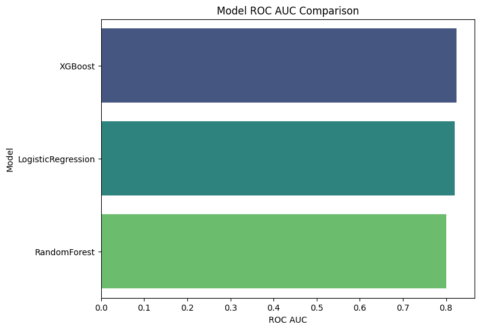

# ASOS Return Prediction Analysis

## 🌍 Project Overview

This project explores whether we can predict if a customer will return an item purchased from ASOS. Product returns are costly for both the business and the customer experience. By building predictive models, ASOS can:

- Optimize inventory management  
- Reduce logistics and handling costs  
- Improve customer satisfaction by identifying patterns leading to returns  

We analyzed over 1.3 million purchase records from the [ASOS Graph Returns Dataset](https://osf.io/c793h/), introduced in the paper [Customer and Product Graphs for Return Prediction in Fashion E-commerce (2023)](https://arxiv.org/pdf/2302.14096). This dataset supports research in graph-based machine learning and recommender systems.

---

## 📊 The Data

The dataset contains millions of e-commerce transactions enriched with:

- **Customer Information**: demographics (e.g., year of birth, gender)  
- **Product Information**: item ID, brand, and type  
- **Historical Behavior**: aggregated customer and product return rates  
- **Order Details**: purchase events, labeled with whether the item was returned  

Before analysis, the data was cleaned, missing values handled, and categorical features encoded.

---

## 🤖 Our Approach

We trained three machine learning models to predict whether an item would be returned:

- **Random Forest** – Combines many decision trees  
- **Logistic Regression** – A simpler model that estimates probabilities  
- **XGBoost** – A high-performance boosting model  

We evaluated them using **ROC AUC**, which measures how well a model separates returns vs. non-returns.

---

## 🏆 Results

| Model               | Accuracy | Precision | Recall | ROC AUC |
|--------------------|----------|-----------|--------|---------|
| XGBoost            | 0.742    | 0.751     | 0.798  | 0.825   |
| Logistic Regression| 0.739    | 0.749     | 0.793  | 0.820   |
| Random Forest      | 0.725    | 0.742     | 0.771  | 0.801   |

📊 ROC AUC Comparison:  

📉 ROC Curves:

![XGBoost ROC]](Models/xgboost_roc_curve.png)

---

## 🔍 What Influences Returns?

XGBoost performed best with the highest ROC AUC. Strongest predictors of returns:

- **Customer past return rate** – most important factor  
- **Product return rate** – some products are “return-prone” 
- **Shipping country** – regional differences in returns  
- **Customer demographics** – gender, etc., had a small influence  

📊 Feature Importance:  

---

## 📈 Visual Insights

To explore patterns in return behavior, we used dimensionality reduction:

- **PCA**: Revealed partial separation between returned and non-returned items  
   

- **t-SNE**: Showed more distinct clusters, though overlap remains  
 

Returns are influenced by complex patterns not easily separable in two dimensions.

---

## ⚖️ Certainty & Limitations

- Predictions are **probabilistic**, not deterministic  
- Influenced by fashion trends, style preferences, and external factors not in the dataset  
- Missing shipping data introduces uncertainty  
- Dataset covers a specific historical window; future behavior may differ  

---

## ✅ Conclusion

Returns are predictable to a useful extent.  
XGBoost is the strongest tool tested.  
Historical behavior (customer + product) drives returns more than demographics.

**Business impact:**

- Better inventory planning  
- Improved size & description guidance  
- Reduced logistics costs from returns  

---

## 📂 How to Run the Project

1. Download the dataset from the [OSF ASOS Dataset](https://osf.io/c793h/)  
2. Run the provided script: `run_analysis.py`  
3. Artifacts (plots, metrics, SHAP feature importance, predictions) will be saved in the `Models` folder  
