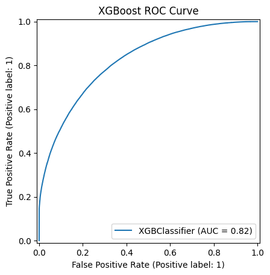
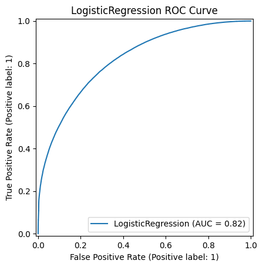
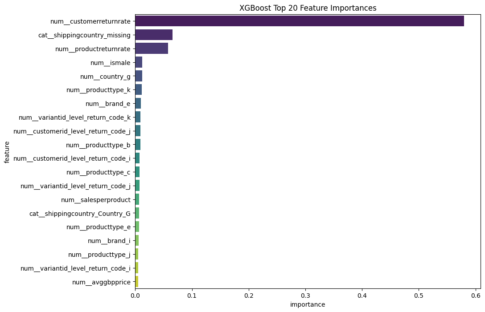
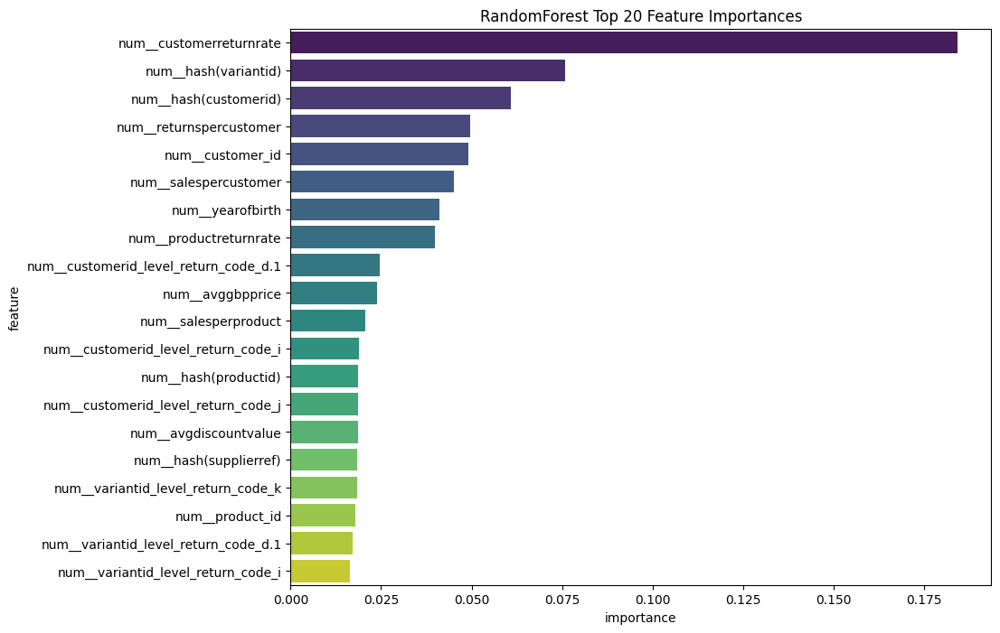
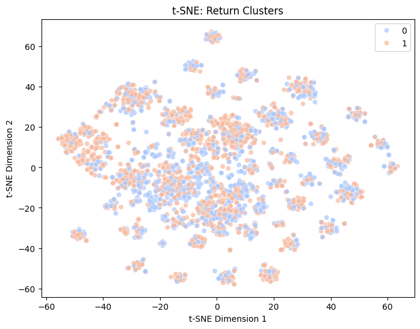

# ASOS Return Prediction Project: Technical Documentation

## 🎯 Project Objective

The primary objective of this project is to develop and evaluate machine learning models to predict the likelihood of a purchased item being returned by an ASOS customer. From a data science perspective, this is a binary classification problem where the goal is to classify each order as either 'returned' (positive class) or 'not returned' (negative class). Accurate prediction can support business initiatives such as:

* Optimizing inventory management
* Personalizing customer experiences
* Reducing operational costs associated with returns

---

## 📦 Dataset Description

* Source: [ASOS Graph Returns Dataset](https://osf.io/c793h/)
* Reference: [Customer and Product Graphs for Return Prediction in Fashion E-commerce (2023)](https://arxiv.org/pdf/2302.14096)
* Format: `/content/merged_events_train.joblib`
* Records: 1,369,133
* Features: 77 total

  * Numeric (73): Customer demographics, product metrics, return rates, pricing
  * Categorical (3): Shipping country and similar fields
* Target: `isreturned` or `label` (binary: 1 = returned, 0 = not returned)

---

## 🧹 Data Preprocessing

### Label Extraction

```python
label_col = "isreturned" if "isreturned" in df.columns else "label"
X = df.drop(columns=[label_col])
y = df[label_col].astype(int)

# Feature Type Identification
numeric_cols = X.select_dtypes(include=[np.number]).columns.tolist()
categorical_cols = X.select_dtypes(include=["object", "category"]).columns.tolist()
```

### Pipelines

* Numeric: Median imputation + StandardScaler
* Categorical: Constant imputation + OneHotEncoder

```python
num_pipeline = Pipeline([
    ("impute", SimpleImputer(strategy="median")),
    ("scale", StandardScaler())
])

cat_pipeline = Pipeline([
    ("impute", SimpleImputer(strategy="constant", fill_value="missing")),
    ("ohe", OneHotEncoder(handle_unknown="ignore", sparse_output=False))
])

preprocessor = ColumnTransformer([
    ("num", num_pipeline, numeric_cols),
    ("cat", cat_pipeline, categorical_cols)
], remainder="drop")
```

### 🔀 Train/Test Split

* 80/20 split
* Stratified by target
* Random seed for reproducibility

```python
X_train_raw, X_test_raw, y_train, y_test = train_test_split(
    X, y, test_size=0.2, stratify=y, random_state=42
)

X_train = preprocessor.fit_transform(X_train_raw)
X_test = preprocessor.transform(X_test_raw)
feature_names = preprocessor.get_feature_names_out()
```

## 🤖 Models Used

```python
models = {
    "RandomForest": RandomForestClassifier(random_state=42),
    "LogisticRegression": LogisticRegression(max_iter=1000, random_state=42),
    "XGBoost": XGBClassifier(use_label_encoder=False, eval_metric="logloss", random_state=42)
}
```

---

## 📊 Model Training and Evaluation

Each model was trained on X\_train and evaluated on X\_test using:

* Accuracy
* Precision
* Recall
* ROC AUC

### Results Summary

| Model               | Accuracy | Precision | Recall | ROC AUC |
| ------------------- | -------- | --------- | ------ | ------- |
| XGBoost             | 0.742    | 0.751     | 0.798  | 0.825   |
| Logistic Regression | 0.739    | 0.749     | 0.793  | 0.820   |
| Random Forest       | 0.725    | 0.742     | 0.771  | 0.801   |

### 📊 ROC AUC Comparison


### 📉 ROC Curves





## 🔥 Feature Importance

Top Features from XGBoost:

* num\_\_customerreturnrate
* cat\_\_shippingcountry\_missing
* num\_\_productreturnrate
* num\_\_ismale
* num\_\_country\_g

### 📊 XGBoost Feature Importance



### 📊 Random Forest Feature Importance




---

## 🌌 Dimensionality Reduction for Visualization

### PCA (Principal Component Analysis)

* Sample size: up to 10,000
* Revealed partial separation but significant overlap
  

### t-SNE (t-Distributed Stochastic Neighbor Embedding)

* Sample size: up to 3,000
* Showed more distinct clusters, but still intermixed
 
 
---

## 🧠 SHAP Analysis

* Static force plot:
  

* Interactive HTML:


---

## 📤 Exported Predictions

* File: asos\_return\_prediction\_artifacts/asos\_return\_predictions.csv
* Includes predicted return status, probability, and actual label

---

## ✅ Conclusion and Next Steps

* Hyperparameter tuning for XGBoost
* Feature engineering and enrichment
* Explore deep learning and graph-based models
* Analyze misclassified instances
* Integrate model into ASOS systems for real-time prediction

---

## 📚 Reference

* McGowan et al. (2023). [Customer and Product Graphs for Return Prediction in Fashion E-commerce](https://arxiv.org/pdf/2302.14096)
* Dataset: [ASOS Graph Returns Dataset](https://osf.io/c793h/)
