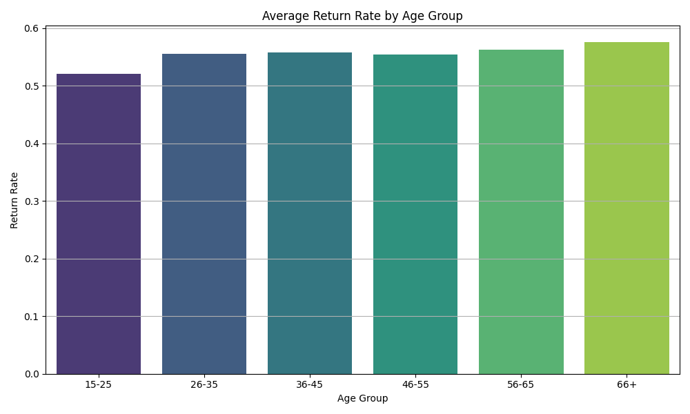

# ASOS Return Prediction: Results Communication & Stakeholder Analysis

## 🌍 Project Overview

This document communicates the main findings from the ASOS Return Prediction project, integrating both **modeling results**, **data exploration insights**, and a **stakeholder analysis**. It focuses on patterns, feature importance, and visualizations to help understand why products are returned and how different stakeholders can use these insights.

---

## 🏆 Key Findings

### Model Performance

Three models were evaluated for predicting returns:

| Model               | Accuracy | Precision | Recall | ROC AUC |
| ------------------- | -------- | --------- | ------ | ------- |
| XGBoost             | 0.742    | 0.751     | 0.798  | 0.825   |
| Logistic Regression | 0.739    | 0.749     | 0.793  | 0.820   |
| Random Forest       | 0.725    | 0.742     | 0.771  | 0.801   |

* **XGBoost** performed best in distinguishing returned vs. non-returned items.

📊 ROC AUC Comparison:
!\[Model ROC AUC Comparison]\(4\_data\_analysis/ASOS dataset/Models/model\_roc\_comparison.png)

---

### Feature Importance

Most influential predictors of returns included:

* **Customer past return rate**
* **Product return rate**
* **Shipping country**
* **Customer demographics** (gender, age)

📊 XGBoost Feature Importance:

📊 Random Forest Feature Importance:

---

### Patterns in Returns

#### Dimensionality Reduction

* **PCA**: Showed partial separation between returned and non-returned items

  
  
* **t-SNE**: Showed more distinct clusters, but still overlapping
 
 

#### SHAP Analysis

* Explains individual predictions and global feature impact

* Static force plot:
  

---

## 📊 Data Exploration Visualizations

These charts highlight customer, product, and transaction-level patterns related to returns:

* **Shipping Countries with Highest Return Rates**
 

* **Product Types with Highest Return Rates**

* **Brands with Highest Return Rates**

* **Return Rate by Age Group**

* **Return Rate by Gender**

* **Return Rate by Premier Status**

* **Customer Purchase Behavior**

* **Product Pricing & Discounts**

---

## 👥 Stakeholder Analysis

### Target Audience

A mid-sized online fashion retailer specializing in formal and event wear.

**Key stakeholders:**

* **Founder/CEO** – concerned with profitability, reputation, growth.
* **Head of Merchandising/Buying** – impacts inventory and product selection.
* **Marketing Manager** – manages promotions, customer communication, social media.
* **E-commerce Manager** – responsible for website experience and product content.
* **Operations/Customer Service Lead** – manages shipping, returns, and customer feedback.

### Capabilities

* Agility in decision-making (faster than large corporations).
* Deep niche expertise in formal/event wear.
* Direct customer feedback loop through service leads.

### Constraints

* Limited resources and smaller data teams.
* Supplier influence limited.
* High customer expectations for fit and quality.

### Communication Strategy

* **Primary**: Hands-on strategy workshop with stakeholders.
* **Secondary**: Practical “Playbook Report” (e.g., *5-Step Playbook to Reduce Returns by 15%*).
* **Tertiary**: Lightweight integrated tool to predict product return risk.

### What Stakeholders Should Learn

* Pinpoint the biggest drivers of returns (e.g., product types, fabrics).
* Quantify the financial drain of returns.
* Spot high-risk products earlier in the buying process.
* Appreciate the value of better product data and descriptions.

### Recommended Actions

* **Buying Team**: Review high-risk product categories; negotiate smaller initial orders.
* **Marketing**: Create content for better customer fit guidance; pause ads on high-return items.
* **E-commerce Manager**: Update product pages with better visuals and fit notes.
* **CEO**: Champion data-driven strategy with a dedicated returns-reduction budget.

---

## 📈 Insights Summary

* **Customer behavior** is the strongest driver of returns.
* Certain products, brands, and regions are consistently more prone to returns.
* Returns are influenced by **complex, high-dimensional patterns**, as confirmed by PCA, t-SNE, SHAP, and exploratory visualizations.

---

## ⚖️ Limitations

* Predictions are **probabilistic**, not deterministic.
* External factors (e.g., trends, seasonality) are not included.
* Missing features such as product descriptions, material, and fit issues limit interpretability.

---

## ✅ Conclusion

* Returns are **predictable to a useful extent** using historical customer and product behavior.
* Insights can help ASOS:

  * Improve inventory and logistics planning
  * Target high-return product categories for improvement
  * Personalize customer guidance to reduce avoidable returns
* Stakeholders can use these findings to implement **practical, high-impact changes** across buying, marketing, e-commerce, and customer service.

---

*This document communicates results, visualizations, and stakeholder-specific recommendations to support decision-making.*
